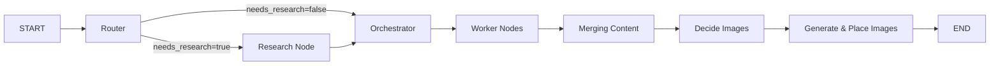

# 🤖 Blog Writing Agent

An AI-powered blog writing agent built with **LangGraph** and **Google Gemini**. This agent automates the entire blog creation process—from research and planning to writing and image generation.


---

## ✨ Features

- **Intelligent Routing** - Automatically determines if web research is needed based on topic type
- **Web Research** - Uses Tavily Search to gather up-to-date information for hybrid/open-book topics
- **Smart Planning** - Creates structured blog outlines with sections, word targets, and content requirements
- **Parallel Section Writing** - Worker nodes write each section concurrently for faster generation
- **AI Image Generation** - Automatically generates relevant diagrams/images using Gemini
- **Streamlit UI** - Interactive frontend with real-time progress tracking and downloadable outputs

---

## 🏗️ Architecture



### Nodes

| Node | Description |
|------|-------------|
| **Router** | Classifies topic as `closed_book`, `hybrid`, or `open_book` |
| **Research** | Queries Tavily Search and synthesizes evidence |
| **Orchestrator** | Creates detailed blog plan with 5-9 sections |
| **Worker** | Writes individual sections following the plan |
| **Merging** | Combines all sections into a single markdown document |
| **Decide Images** | Plans image placeholders and generates prompts |
| **Generate Images** | Creates images using Gemini and embeds them in markdown |

---

## 📁 Project Structure

```
Blog writing agent/
├── backend.py              # LangGraph workflow (all nodes and state)
├── frontend.py             # Streamlit UI
├── .env                    # API keys (GOOGLE_API_KEY, TAVILY_API_KEY)
├── .gitignore
├── outputs/                # Generated blog posts
├── images/                 # Generated images
└── notebooks/              # Development notebooks
    ├── 1_basic_blog_agent.ipynb
    ├── 2_updated_blog_agent.ipynb
    ├── 3_adding_research_node.ipynb
    └── 4_generating_images.ipynb
```

---

## 🚀 Getting Started

### Prerequisites

- Python 3.10+
- Google API Key (for Gemini)
- Tavily API Key (for web search)

### Installation

1. **Clone the repository**
   ```bash
   git clone https://github.com/Godcoder2005/Blog_wriring_agent.git
   cd Blog_wriring_agent
   ```

2. **Create virtual environment**
   ```bash
   python -m venv venv
   venv\Scripts\activate  # Windows
   # source venv/bin/activate  # Linux/macOS
   ```

3. **Install dependencies**
   ```bash
   pip install langgraph langchain-google-genai langchain-community langchain-tavily
   pip install streamlit pandas pydantic python-dotenv google-genai
   ```

4. **Set up environment variables**
   
   Create a `.env` file:
   ```env
   GOOGLE_API_KEY=your_google_api_key
   TAVILY_API_KEY=your_tavily_api_key
   ```

### Running the App

```bash
streamlit run frontend.py
```

Open `http://localhost:8501` in your browser.

---

## 📖 Usage

1. **Enter a topic** in the sidebar (e.g., "State of Multimodal LLMs in 2026")
2. **Click "Generate Blog"** to start the agent
3. **Monitor progress** in real-time via the status updates
4. **Explore tabs**:
   - **Plan** - View the generated outline and section details
   - **Evidence** - See research sources (for hybrid/open-book topics)
   - **Preview** - Read the final markdown with rendered images
   - **Images** - View and download generated images
   - **Logs** - Debug and trace agent execution
5. **Download** the markdown file or full bundle (MD + images)

---

## 🔧 How It Works

### Routing Modes

| Mode | When Used | Research |
|------|-----------|----------|
| `closed_book` | Evergreen topics (concepts, fundamentals) | ❌ No |
| `hybrid` | Mostly evergreen but needs current examples | ✅ Yes |
| `open_book` | News roundups, latest rankings, volatile topics | ✅ Yes |

### State Schema

```python
class BlogWriter(TypedDict):
    topic: str
    mode: str                    # closed_book, hybrid, open_book
    needs_research: bool
    queries: List[str]           # search queries for research
    evidence: List[EvidenceItem] # research results
    plan: Optional[Plan]         # blog outline
    sections: List[tuple]        # (section_id, markdown)
    merged_md: str               # combined markdown
    image_specs: list[dict]      # image generation specs
    final: str                   # final output
```

---

## 🛠️ Development

The project was developed iteratively through Jupyter notebooks:

1. **Basic Agent** - Simple orchestrator → worker → reducer flow
2. **Updated Agent** - Added structured output with Pydantic
3. **Research Node** - Integrated Tavily for web research
4. **Image Generation** - Added Gemini image generation

To explore the development process, check out the notebooks in order.

---

## 📝 Example Output

The agent generates:
- **Structured markdown** with proper headings, code blocks, and citations
- **AI-generated diagrams** embedded directly in the document
- **Downloadable bundle** with all assets

---

## 🤝 Contributing

1. Fork the repository
2. Create a feature branch (`git checkout -b feature/amazing-feature`)
3. Commit your changes (`git commit -m 'Add amazing feature'`)
4. Push to the branch (`git push origin feature/amazing-feature`)
5. Open a Pull Request

---

## 📄 License

This project is open source and available under the [MIT License](LICENSE).

---

## 🙏 Acknowledgments

- [LangGraph](https://github.com/langchain-ai/langgraph) - Agent orchestration
- [Google Gemini](https://ai.google.dev/) - LLM and image generation
- [Tavily](https://tavily.com/) - Web search API
- [Streamlit](https://streamlit.io/) - Frontend framework

---

**Built with ❤️ by [Godcoder2005](https://github.com/Godcoder2005)**
